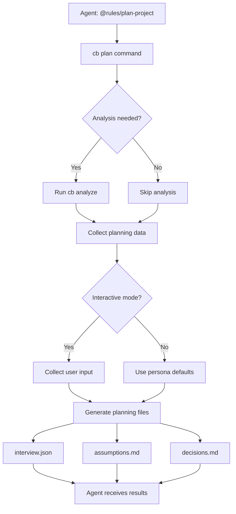

# Implementation Guide

## Installation Scaffolding

### Overview
The Code Builder overlay system requires specific directory structures and state files to function properly. This section covers the scaffolding process that creates the necessary infrastructure.

### Required Directories

#### Core Overlay Directories
- **`.cb/`** - Main overlay directory (created by installer only)
  - **`.cb/commands/`** - Generated command files
  - **`.cb/instructions/`** - Runtime instructions and status
  - **`.cb/engine/`** - Overlay engine components
    - **`.cb/engine/templates/commands/`** - Command templates
  - **`.cb/cache/`** - Runtime cache
    - **`.cb/cache/command_state/`** - Command state and metrics

#### Cursor Integration
- **`.cursor/rules/`** - Cursor rules directory (for rule merging)

### State Files

#### Command State (`state.json`)
```json
{
  "version": "1.0.0",
  "created": "2025-01-15T00:00:00Z",
  "updated": "2025-01-15T00:00:00Z",
  "project_state": {
    "initialized": false,
    "discovered": false,
    "analyzed": false,
    "planned": false,
    "context_created": false
  },
  "command_history": [],
  "active_tasks": [],
  "completed_tasks": [],
  "cache_metadata": {
    "last_cleanup": null,
    "size_bytes": 0,
    "file_count": 0
  }
}
```

#### Metrics (`metrics.json`)
```json
{
  "version": "1.0.0",
  "created": "2025-01-15T00:00:00Z",
  "updated": "2025-01-15T00:00:00Z",
  "command_metrics": {
    "total_commands_run": 0,
    "successful_commands": 0,
    "failed_commands": 0,
    "average_execution_time_ms": 0,
    "most_used_commands": []
  },
  "discovery_metrics": {
    "time_to_first_rules": null,
    "command_discovery_rate": 0.0,
    "execution_success_rate": 0.0
  },
  "performance_metrics": {
    "cache_hit_rate": 0.0,
    "average_response_time_ms": 0,
    "memory_usage_mb": 0
  },
  "session_metrics": {
    "current_session_start": null,
    "total_sessions": 0,
    "average_session_duration_minutes": 0
  }
}
```

### Directory Permissions

All directories should have standard permissions (755):
```bash
drwxr-xr-x  # Owner: read/write/execute, Group: read/execute, Other: read/execute
```

### Git Integration

The `.cb/` directory is automatically ignored by git:
```gitignore
.cb/
.cb/*
```

### Validation

#### Directory Structure Check
```bash
# Verify all required directories exist
find .cb -type d | sort
find .cursor -type d | sort
```

#### State File Validation
```bash
# Verify JSON files are valid
python3 -c "import json; json.load(open('.cb/cache/command_state/state.json'))"
python3 -c "import json; json.load(open('.cb/cache/command_state/metrics.json'))"
```

#### CLI Functionality
```bash
# Test basic CLI functionality
python3 -m builder.core.cli rules:show
```

### Troubleshooting

#### Missing Directories
If directories are missing, recreate them:
```bash
mkdir -p .cb/commands .cb/instructions .cb/engine/templates/commands .cb/cache/command_state .cursor/rules
```

#### Invalid State Files
If state files are corrupted, recreate them with the minimal schema above.

#### Permission Issues
Ensure proper permissions:
```bash
chmod -R 755 .cb/ .cursor/
```

### Path Translation Layer

The Code Builder uses a dual-mode path resolution system that works in both overlay and standalone modes. This ensures consistent behavior regardless of how the system is deployed.

#### OverlayPaths Usage

```python
from .cb.engine.builder.overlay.paths import OverlayPaths, overlay_paths

# Use global instance
paths = overlay_paths

# Or create new instance
paths = OverlayPaths()

# Get mode information
if paths.is_overlay_mode():
    print("Running in overlay mode")
else:
    print("Running in standalone mode")

# Get common paths
root = paths.cb_root()
docs_dir = paths.cb_docs_dir()
rules_dir = paths.cursor_rules_dir()
tasks_index = paths.tasks_index()
logs_dir = paths.logs_dir()
cache_dir = paths.cache_dir()

# Ensure all directories exist
paths.ensure_directories()

# Validate configuration
if paths.validate():
    print("All paths are valid and accessible")
```

#### Convenience Functions

```python
from .cb.engine.builder.overlay.paths import (
    cb_root, cursor_rules_dir, cb_docs_dir, 
    tasks_index, logs_dir
)

# Direct access to common paths
root = cb_root()
docs = cb_docs_dir()
rules = cursor_rules_dir()
```

#### Validation

Test the path resolution system:

```bash
# Validate OverlayPaths configuration
python3 .cb/engine/builder/overlay/paths.py validate
```

### Install Hook - setup_commands()

The installer now includes a `setup_commands()` function that:

1. **Creates Command Files**: Generates `analyze-project.md` and `plan-project.md` in `.cb/commands/`
2. **Rule Merger**: Creates `.cb/bin/merge-rules` script that:
   - Detects existing project rules (`.cursor/rules/`, `docs/rules/`, `.cursorrules`)
   - Merges project rules with Code Builder rules (project rules have higher priority)
   - Creates `merged_rules.md` with proper precedence
3. **@rules/ Files**: Generates individual `@rules/` files for each command
4. **Idempotent**: Safe to run multiple times

**Usage:**
```bash
# The function runs automatically during installation
bash scripts/install.sh

# Or run the rule merger manually
.cb/bin/merge-rules
```

**Output:**
- `.cb/commands/*.md` - Command definitions
- `.cb/.cursor/rules/` - @rules/ files and merged rules
- `.cb/bin/merge-rules` - Rule merger script

### Command Utilities

The CLI now includes a comprehensive `commands:*` family for managing command definitions:

#### Available Commands
- **`cb commands:list`** - List all available commands with filtering and multiple output formats
- **`cb commands:show <name>`** - Show detailed information about a specific command
- **`cb commands:refresh`** - Refresh commands from templates and sync to `.cb/commands/`
- **`cb commands:sync`** - Sync commands with rule merger and update `@rules/` files

#### Features
- **Multiple Output Formats**: Table (default), JSON, YAML for `commands:list`
- **Status Filtering**: Filter by `active`, `inactive`, or `all` commands
- **Detailed Views**: Full, metadata-only, or usage-only views for `commands:show`
- **Template Management**: Copy from `.cb/engine/templates/commands/` to `.cb/commands/`
- **Rule Integration**: Automatically sync with rule merger for `@rules/` files
- **Error Handling**: Consistent error codes and helpful messages

#### Usage Examples
```bash
# List all active commands in table format
cb commands:list

# List commands in JSON format
cb commands:list --format json

# Show detailed information about a command
cb commands:show analyze-project

# Show only usage information
cb commands:show analyze-project --format usage

# Refresh commands from templates
cb commands:refresh --force

# Sync with rule merger
cb commands:sync
```

#### Command File Structure
Commands are defined in `.cb/commands/*.md` files with YAML frontmatter:
```yaml
---
id: command-name
title: Command Title
description: Brief description
status: active
created: 2025-01-15
updated: 2025-01-15
owner: system
domain: discovery
priority: 8
agent_type: backend
dependencies: []
tags: [discovery, analysis, project]
---

# Command: Command Title

## Description
Detailed description...

## Usage
```bash
cb command-name
```

## Examples
```bash
cb command-name --option value
```
```

## Simple Commands

### Overview
Simple commands provide easy-to-use aliases for common Code Builder operations. These commands are implemented in `builder/overlay/simple_router.py` and provide a simplified interface to the full command system.

### Available Simple Commands

#### `cb analyze`
Analyze project structure and generate discovery report.

**Usage:**
```bash
cb analyze [OPTIONS]
```

**Options:**
- `--depth INTEGER` - Analysis depth (default: 3)
- `--ignore TEXT` - Ignore files matching pattern
- `--ci` - Non-interactive mode for CI/CD

**Examples:**
```bash
# Basic analysis
cb analyze

# Deep analysis with custom ignore
cb analyze --depth 5 --ignore "node_modules,dist"

# CI mode
cb analyze --ci
```

**Outputs:**
- `cb_docs/discovery/analysis.json` - Detailed project analysis
- `cb_docs/discovery/summary.md` - Human-readable summary

#### `cb plan`
Create project plan through guided interview.

**Usage:**
```bash
cb plan [OPTIONS]
```

**Options:**
- `--persona [dev|pm|ai]` - Interview persona (default: dev)
- `--noninteractive` - Use defaults instead of prompts

### Implementation Details

#### Simple Router Architecture
The simple router (`builder/overlay/simple_router.py`) provides:

1. **Command Aliases**: Maps short commands to full implementations
2. **Parameter Mapping**: Converts simple parameters to complex command parameters
3. **Error Handling**: Graceful fallback when underlying commands fail
4. **Dual Mode Support**: Works in both overlay and standalone modes

#### Command Registration
Simple commands are registered with the main CLI through the `@cli.command` decorator:

```python
@cli.command("analyze")
@click.option("--depth", type=int, default=3)
@click.option("--ignore", help="Ignore files matching pattern")
@click.option("--ci", is_flag=True)
def analyze_command(depth, ignore, ci):
    # Implementation
```

#### @rules/ Integration
Simple commands automatically generate `@rules/` files for Cursor agent integration:

- **Command-specific rules**: `@rules/analyze-project`
- **Project status rules**: `@rules/project-status`

#### Dual Mode Support
Simple commands work in both modes:

- **Overlay Mode**: When `.cb/` directory exists
- **Standalone Mode**: When running from any directory

### Usage Examples

#### Basic Project Analysis
```bash
# Analyze current project
cb analyze

# Analyze with specific depth
cb analyze --depth 5

# Analyze in CI mode
cb analyze --ci
```

#### Project Planning
```bash
# Interactive planning
cb plan

# Developer persona planning
cb plan --persona dev

# Non-interactive planning
cb plan --noninteractive
```

#### Agent Integration
```bash
# Get recommended command for agents
cb agent:get-command

# Create @rules/ files
cb agent:integrate
```

### Error Handling

Simple commands provide robust error handling:

1. **Import Errors**: Clear messages when underlying commands are unavailable
2. **Parameter Errors**: Validation and helpful error messages
3. **File System Errors**: Graceful handling of permission and path issues
4. **Fallback Suggestions**: Alternative commands when primary commands fail

## Discovery Engine

### Overview
The Enhanced Discovery Engine provides comprehensive project analysis capabilities, detecting languages, frameworks, package managers, testing tools, and other project characteristics.

### Features

#### Language Detection
- **Primary Language**: Identifies the main programming language
- **All Languages**: Detects all languages present in the project
- **File Counts**: Counts files by language type

#### Framework Detection
- **Web Frameworks**: Express, Flask, Django, FastAPI, React, Vue, Angular, etc.
- **Testing Frameworks**: Jest, pytest, Mocha, etc.
- **Build Tools**: Webpack, Vite, Rollup, etc.

#### Package Manager Detection
- **Primary Manager**: Identifies the main package manager
- **All Managers**: Detects all package managers present
- **Configuration Files**: Identifies package.json, requirements.txt, etc.

#### Project Structure Analysis
- **File Counts**: Total files and directories
- **Size Analysis**: Project size in bytes
- **Depth Control**: Configurable analysis depth (1-5)
- **Ignore Patterns**: Customizable file/folder exclusions

### Output Contract

#### Report JSON (`cb_docs/discovery/report.json`)
```json
{
  "project_info": {
    "name": "project-name",
    "type": "Node.js",
    "file_count": 1234,
    "directory_count": 567,
    "size_bytes": 12345678,
    "analysis_depth": 3,
    "timestamp": "2025-01-15T12:00:00Z"
  },
  "languages": {
    "primary": "JavaScript",
    "detected": ["JavaScript", "TypeScript", "Markdown"],
    "file_counts": {
      "JavaScript": 100,
      "TypeScript": 50,
      "Markdown": 10
    }
  },
  "frameworks": {
    "detected": ["express", "react", "jest"],
    "categories": {
      "web": ["express"],
      "frontend": ["react"],
      "testing": ["jest"]
    }
  },
  "package_managers": {
    "primary": "npm",
    "detected": ["npm", "yarn"],
    "files": {
      "npm": "package.json",
      "yarn": "yarn.lock"
    }
  },
  "testing": {
    "runners": ["jest", "vitest"],
    "config_files": ["jest.config.js", "vitest.config.ts"]
  },
  "linting": {
    "tools": ["eslint", "prettier"],
    "config_files": [".eslintrc.js", ".prettierrc"]
  },
  "build_tools": {
    "detected": ["webpack", "vite"],
    "config_files": ["webpack.config.js", "vite.config.ts"]
  }
}
```

#### Summary Markdown (`cb_docs/discovery/summary.md`)
```markdown
# Project Discovery Summary

**Project:** project-name
**Type:** Node.js
**Files:** 1,234
**Size:** 12,345,678 bytes

## Languages
**Primary:** JavaScript
**Detected:** JavaScript, TypeScript, Markdown

## Frameworks
**Detected:** express, react, jest

## Package Managers
**Primary:** npm
**Detected:** npm, yarn

## Testing
**Runners:** jest, vitest

## Linting
**Tools:** eslint, prettier

## Build Tools
**Detected:** webpack, vite
```

### Usage

#### Basic Analysis
```bash
cb analyze
```

#### Advanced Options
```bash
# Deep analysis with custom ignore patterns
cb analyze --depth 5 --ignore "node_modules,dist,coverage"

# CI mode for automated environments
cb analyze --ci
```

#### Programmatic Usage
```python
from builder.discovery.enhanced_engine import analyze_project_enhanced

# Analyze current directory
result = analyze_project_enhanced()

# Analyze specific directory
result = analyze_project_enhanced(
    root_path="path/to/project",
    depth=3,
    ignore_patterns=["node_modules", "dist"],
    ci_mode=True
)
```

### Configuration

#### Analysis Depth
- **1**: Basic file scanning
- **2**: Language detection
- **3**: Framework detection (default)
- **4**: Package manager analysis
- **5**: Deep configuration analysis

#### Ignore Patterns
Common patterns to exclude:
- `node_modules` - Node.js dependencies
- `dist` - Build output
- `coverage` - Test coverage reports
- `.git` - Git repository data
- `__pycache__` - Python cache

### Integration Points

#### State Management
The discovery engine updates project state:
```json
{
  "project_state": {
    "discovered": true,
    "last_discovery": "2025-01-15T12:00:00Z",
    "analysis_depth": 3
  }
}
```

#### Command Integration
- **Simple Router**: `cb analyze` command
- **CLI Commands**: `discover:analyze` command
- **Agent Integration**: `@rules/analyze-project`

### Testing

#### Fixture Repositories
Test fixtures are available in `tests/fixtures/`:
- **js-project**: Node.js/Express project
- **py-project**: Python/Flask project
- **mixed-project**: Multi-language project

#### Golden Snapshots
Expected outputs are stored as golden snapshots for regression testing.

## Agent-OS Bridge

### Overview
The Agent-OS Bridge provides a mapping layer between agent-friendly commands and the underlying Code Builder functionality. This bridge enables Cursor agents to interact with Code Builder through simple, intuitive commands.

### Architecture

#### Command Flow
```
Agent Command → Agent-OS Bridge → Code Builder Implementation → Output Files
```

#### Supported Commands
- **`cb plan`** → Project planning with interview functionality
- **`cb analyze`** → Project analysis and discovery
- **`cb status`** → Project status and recommendations
- **`cb commands`** → Available command listing

### Implementation

#### Agent-OS Bridge Module
The bridge is implemented in `builder/overlay/agent_os_bridge.py` and provides:

1. **Command Mapping**: Maps agent commands to full implementations
2. **Parameter Translation**: Converts simple parameters to complex command parameters
3. **Output Generation**: Creates structured output files for agents
4. **Error Handling**: Graceful fallback when underlying commands fail

#### Planning Command Flow


#### Persona-Based Planning
The planning command supports three personas:

- **Developer (dev)**: Focus on technical implementation and code quality
- **Project Manager (pm)**: Focus on project management and resource planning
- **AI Specialist (ai)**: Focus on AI/ML capabilities and intelligent automation

### Usage

#### Basic Planning
```bash
# Interactive planning with developer persona
cb plan

# Non-interactive planning with project manager persona
cb plan --persona pm --noninteractive

# Auto-analyze then plan
cb plan --auto-analyze --noninteractive
```

#### Agent Integration
```bash
# Agents can use @rules/plan-project
@rules/plan-project

# This triggers the full planning workflow
```

### Output Files

#### Interview Responses (`cb_docs/planning/interview.json`)
```json
{
  "persona": "dev",
  "timestamp": "2025-01-15T12:00:00Z",
  "planning_data": {
    "product": "Code Builder Project",
    "idea": "Automated code generation and project management",
    "problem": "Manual project setup and maintenance is time-consuming",
    "users": "Developers, project managers, technical teams",
    "features": ["CLI interface", "Project analysis", "Automated workflows"],
    "metrics": ["Development speed", "Code quality", "Project success rate"],
    "tech": ["Python", "JavaScript", "Markdown"],
    "timeline": "3-6 months",
    "team_size": "2-5 developers"
  },
  "status": "completed"
}
```

#### Assumptions Document (`cb_docs/planning/assumptions.md`)
- Product assumptions
- User assumptions
- Technical assumptions
- Feature assumptions
- Risk assumptions

#### Decisions Document (`cb_docs/planning/decisions.md`)
- Architecture decisions
- Feature decisions
- Process decisions
- Success criteria

### Integration Points

#### Command Registration
Agent-OS bridge commands are registered with the main CLI:
```python
@cli.command("plan")
@click.option("--persona", type=click.Choice(['dev', 'pm', 'ai']))
@click.option("--noninteractive", is_flag=True)
@click.option("--auto-analyze", is_flag=True)
def plan_command(persona, noninteractive, auto_analyze):
    # Implementation
```

#### @rules/ Integration
The bridge automatically generates `@rules/` files for Cursor agent integration:
- **Command-specific rules**: `@rules/plan-project`
- **Usage instructions**: Clear agent instructions
- **Expected outputs**: Documented output files

### Error Handling

The Agent-OS Bridge provides robust error handling:

1. **Import Errors**: Clear messages when underlying commands are unavailable
2. **Parameter Validation**: Ensures required parameters are provided
3. **File System Errors**: Graceful handling of permission and path issues
4. **Analysis Dependencies**: Automatic analysis triggering when needed

## Interactive Interview System

### Overview
The Interactive Interview System provides guided Q&A functionality for project planning, with TTY support and persona-based defaults. It generates structured planning documents through interactive or non-interactive modes.

### Features

#### TTY Interactive Support
- **Interactive Mode**: Full TTY-based interview with prompts and defaults
- **Non-Interactive Mode**: Deterministic defaults based on persona
- **TTY Detection**: Automatic fallback to non-interactive in non-TTY environments

#### Persona-Based Planning
- **Developer (dev)**: Focus on technical implementation and code quality
- **Project Manager (pm)**: Focus on project management and resource planning
- **AI Specialist (ai)**: Focus on AI/ML capabilities and intelligent automation

#### Structured Outputs
- **interview.json**: Complete interview responses with metadata
- **assumptions.md**: Generated project assumptions document
- **decisions.md**: Key project decisions and criteria

### Implementation

#### Discovery Interview Module
The interview functionality is implemented in `builder/discovery/interview.py`:

```python
class DiscoveryInterview:
    def conduct_interactive(self, persona: str = "dev", noninteractive: bool = False) -> Dict[str, Any]:
        """Conduct interactive interview with TTY support."""
        # Implementation details...
```

#### CLI Command
The interview is accessible via the `discover:interview` command:

```bash
# Interactive interview with developer persona
cb discover:interview --persona dev

# Non-interactive interview with project manager persona
cb discover:interview --persona pm --noninteractive

# Custom output directory
cb discover:interview --persona ai --output /path/to/output
```

### Question Catalog

#### Core Product Questions
1. **Product Name**: What is the name of your product?
2. **Product Description**: Describe your product in one sentence
3. **Target Users**: Who are your target users?

#### Feature Questions
4. **Key Features**: List the main features (multi-line input)
5. **Success Metrics**: Define success criteria (multi-line input)

#### Technical Questions
6. **Technical Requirements**: Technology stack and requirements
7. **Timeline**: Project development timeline
8. **Team Size**: Development team size
9. **Budget**: Budget level (Low/Moderate/High/Very high)

#### Generated Questions
- **Assumptions**: Automatically generated based on responses
- **Decisions**: Key decisions derived from input
- **Risks**: Persona-specific risk factors

### Persona Defaults

#### Developer Persona
```json
{
  "product_name": "Code Builder Project",
  "product_description": "Automated code generation and project management tool",
  "target_users": "Developers, technical teams, project managers",
  "key_features": ["CLI interface", "Project analysis", "Automated workflows", "Code generation"],
  "success_metrics": ["Development speed", "Code quality", "Project success rate", "Developer satisfaction"],
  "technical_requirements": ["Python", "JavaScript", "Markdown", "YAML"],
  "timeline": "3-6 months",
  "team_size": "2-5 developers",
  "budget": "Moderate"
}
```

#### Project Manager Persona
```json
{
  "product_name": "Project Management System",
  "product_description": "Streamlined project planning and execution platform",
  "target_users": "Project managers, stakeholders, development teams",
  "key_features": ["Planning tools", "Progress tracking", "Resource management", "Reporting"],
  "success_metrics": ["Project completion rate", "Budget adherence", "Timeline accuracy", "Stakeholder satisfaction"],
  "technical_requirements": ["Web technologies", "Database systems", "Reporting tools", "API integration"],
  "timeline": "6-12 months",
  "team_size": "5-10 team members",
  "budget": "High"
}
```

#### AI Specialist Persona
```json
{
  "product_name": "AI-Powered Development Tool",
  "product_description": "Intelligent code generation and project assistance platform",
  "target_users": "AI researchers, developers, technical teams",
  "key_features": ["AI code generation", "Intelligent analysis", "Automated testing", "Machine learning"],
  "success_metrics": ["Code generation accuracy", "Development efficiency", "Bug reduction", "AI model performance"],
  "technical_requirements": ["Machine learning", "Python", "AI frameworks", "Data processing"],
  "timeline": "12-18 months",
  "team_size": "3-7 AI specialists",
  "budget": "Very high"
}
```

### Output Schema

#### Interview JSON Structure
```json
{
  "persona": "dev",
  "timestamp": "2025-01-15T12:00:00Z",
  "product_name": "My Project",
  "product_description": "Project description",
  "target_users": "Target user base",
  "key_features": ["Feature 1", "Feature 2"],
  "success_metrics": ["Metric 1", "Metric 2"],
  "technical_requirements": "Tech stack",
  "timeline": "Project timeline",
  "team_size": "Team size",
  "budget": "Budget level",
  "assumptions": ["Generated assumption 1", "Generated assumption 2"],
  "decisions": ["Decision 1", "Decision 2"],
  "risks": ["Risk 1", "Risk 2"]
}
```

#### Assumptions Document
```markdown
# Project Assumptions

## Product Assumptions
- **Product**: Project Name
- **Description**: Project description
- **Target Users**: Target user base

## Technical Assumptions
- **Requirements**: Technology requirements
- **Timeline**: Development timeline
- **Team Size**: Team structure
- **Budget**: Budget allocation

## Feature Assumptions
- **Key Features**: Core functionality
- **Success Metrics**: Success criteria

## Risk Assumptions
- **Identified Risks**: Known risk factors

## Generated Assumptions
- Assumption 1
- Assumption 2
```

#### Decisions Document
```markdown
# Key Project Decisions

## Product Decisions
- **Product Name**: Project name
- **Target Users**: User base
- **Core Features**: Main functionality

## Technical Decisions
- **Technology Stack**: Tech choices
- **Development Timeline**: Timeline
- **Team Structure**: Team organization
- **Budget Allocation**: Resource allocation

## Success Criteria
- **Primary Metrics**: Success measures

## Generated Decisions
- Decision 1
- Decision 2
```

### Usage Examples

#### Interactive Interview
```bash
# Start interactive interview
cb discover:interview --persona dev

# Example interaction:
# What is the name of your product? [Code Builder Project]: My Awesome App
# Describe your product in one sentence: [Automated code generation and project management tool]: A web app for task management
# Who are your target users? [Developers, technical teams, project managers]: Small business owners
# 
# Key Features (press Enter when done):
# Feature 1: User authentication
# Feature 2: Task creation
# Feature 3: 
# 
# Success Metrics (press Enter when done):
# Metric 1: User engagement
# Metric 2: Task completion rate
# Metric 3: 
```

#### Non-Interactive Interview
```bash
# Use defaults for quick planning
cb discover:interview --persona pm --noninteractive

# Output:
# 📋 Starting interview for pm persona...
# ✅ Interview complete!
# 📄 Interview responses: cb_docs/planning/interview.json
# 📋 Assumptions: cb_docs/planning/assumptions.md
# 🎯 Decisions: cb_docs/planning/decisions.md
```

#### Custom Output
```bash
# Specify custom output directory
cb discover:interview --persona ai --output /path/to/planning

# Files created:
# /path/to/planning/interview.json
# /path/to/planning/assumptions.md
# /path/to/planning/decisions.md
```

### Integration Points

#### Agent-OS Bridge
The interview system integrates with the Agent-OS Bridge:
- **`cb plan`** command uses interview functionality
- **Persona mapping** between bridge and interview
- **Output file generation** for agent consumption

#### Discovery Engine
- **Question sets** align with discovery analysis
- **Output format** compatible with discovery reports
- **Path resolution** uses OverlayPaths for consistency

### Error Handling

The interview system provides robust error handling:

1. **TTY Detection**: Automatic fallback to non-interactive mode
2. **Input Validation**: Graceful handling of empty responses
3. **File System Errors**: Proper error messages for permission issues
4. **Import Errors**: Clear messages when dependencies are missing

### Testing

#### Stability Testing
- **Deterministic Output**: Same inputs produce identical outputs
- **JSON Schema**: Consistent structure across runs
- **File Generation**: Reliable file creation and content

#### Persona Testing
- **Default Values**: Each persona has appropriate defaults
- **Response Generation**: Assumptions and decisions are contextually relevant
- **Output Quality**: Generated documents are well-structured

### Next Steps

After scaffolding is complete:
1. **Command System**: Implement `commands:list`, `commands:refresh`, etc. ✅
2. **Rule Integration**: Set up rule merging with project rules ✅
3. **Template System**: Create command templates ✅
4. **Discovery Engine**: Enhanced project analysis ✅
5. **Agent-OS Bridge**: Agent command mapping ✅
6. **Interactive Interview**: TTY-based planning interviews ✅
7. **State Management**: Implement state updates and persistence
8. **Path Translation**: Use OverlayPaths for all new features
