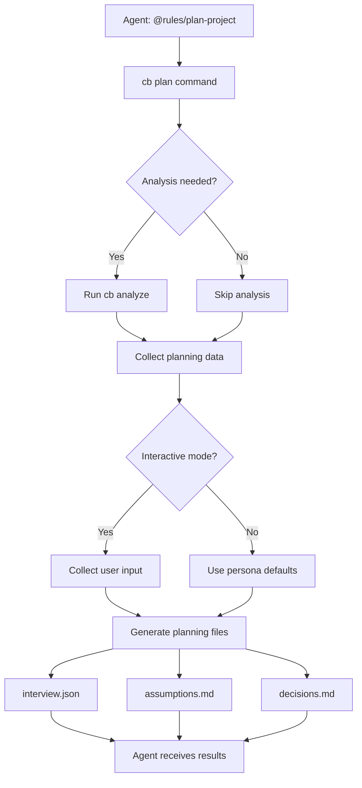

# Implementation Guide

## Installation Scaffolding

### Overview
The Code Builder overlay system requires specific directory structures and state files to function properly. This section covers the scaffolding process that creates the necessary infrastructure.

### Required Directories

#### Core Overlay Directories
- **`.cb/`** - Main overlay directory (created by installer only)
  - **`.cb/commands/`** - Generated command files
  - **`.cb/instructions/`** - Runtime instructions and status
  - **`.cb/engine/`** - Overlay engine components
    - **`.cb/engine/templates/commands/`** - Command templates
  - **`.cb/cache/`** - Runtime cache
    - **`.cb/cache/command_state/`** - Command state and metrics

#### Cursor Integration
- **`.cursor/rules/`** - Cursor rules directory (for rule merging)

### State Files

#### Command State (`state.json`)
```json
{
  "version": "1.0.0",
  "created": "2025-01-15T00:00:00Z",
  "updated": "2025-01-15T00:00:00Z",
  "project_state": {
    "initialized": false,
    "discovered": false,
    "analyzed": false,
    "planned": false,
    "context_created": false
  },
  "command_history": [],
  "active_tasks": [],
  "completed_tasks": [],
  "cache_metadata": {
    "last_cleanup": null,
    "size_bytes": 0,
    "file_count": 0
  }
}
```

#### Metrics (`metrics.json`)
```json
{
  "version": "1.0.0",
  "created": "2025-01-15T00:00:00Z",
  "updated": "2025-01-15T00:00:00Z",
  "command_metrics": {
    "total_commands_run": 0,
    "successful_commands": 0,
    "failed_commands": 0,
    "average_execution_time_ms": 0,
    "most_used_commands": []
  },
  "discovery_metrics": {
    "time_to_first_rules": null,
    "command_discovery_rate": 0.0,
    "execution_success_rate": 0.0
  },
  "performance_metrics": {
    "cache_hit_rate": 0.0,
    "average_response_time_ms": 0,
    "memory_usage_mb": 0
  },
  "session_metrics": {
    "current_session_start": null,
    "total_sessions": 0,
    "average_session_duration_minutes": 0
  }
}
```

### Directory Permissions

All directories should have standard permissions (755):
```bash
drwxr-xr-x  # Owner: read/write/execute, Group: read/execute, Other: read/execute
```

### Git Integration

The `.cb/` directory is automatically ignored by git:
```gitignore
.cb/
.cb/*
```

### Validation

#### Directory Structure Check
```bash
# Verify all required directories exist
find .cb -type d | sort
find .cursor -type d | sort
```

#### State File Validation
```bash
# Verify JSON files are valid
python3 -c "import json; json.load(open('.cb/cache/command_state/state.json'))"
python3 -c "import json; json.load(open('.cb/cache/command_state/metrics.json'))"
```

#### CLI Functionality
```bash
# Test basic CLI functionality
python3 -m builder.core.cli rules:show
```

### Troubleshooting

#### Missing Directories
If directories are missing, recreate them:
```bash
mkdir -p .cb/commands .cb/instructions .cb/engine/templates/commands .cb/cache/command_state .cursor/rules
```

#### Invalid State Files
If state files are corrupted, recreate them with the minimal schema above.

#### Permission Issues
Ensure proper permissions:
```bash
chmod -R 755 .cb/ .cursor/
```

### Path Translation Layer

The Code Builder uses a dual-mode path resolution system that works in both overlay and standalone modes. This ensures consistent behavior regardless of how the system is deployed.

#### OverlayPaths Usage

```python
from .cb.engine.builder.overlay.paths import OverlayPaths, overlay_paths

# Use global instance
paths = overlay_paths

# Or create new instance
paths = OverlayPaths()

# Get mode information
if paths.is_overlay_mode():
    print("Running in overlay mode")
else:
    print("Running in standalone mode")

# Get common paths
root = paths.cb_root()
docs_dir = paths.cb_docs_dir()
rules_dir = paths.cursor_rules_dir()
tasks_index = paths.tasks_index()
logs_dir = paths.logs_dir()
cache_dir = paths.cache_dir()

# Ensure all directories exist
paths.ensure_directories()

# Validate configuration
if paths.validate():
    print("All paths are valid and accessible")
```

#### Convenience Functions

```python
from .cb.engine.builder.overlay.paths import (
    cb_root, cursor_rules_dir, cb_docs_dir, 
    tasks_index, logs_dir
)

# Direct access to common paths
root = cb_root()
docs = cb_docs_dir()
rules = cursor_rules_dir()
```

#### Validation

Test the path resolution system:

```bash
# Validate OverlayPaths configuration
python3 .cb/engine/builder/overlay/paths.py validate
```

### Install Hook - setup_commands()

The installer now includes a `setup_commands()` function that:

1. **Creates Command Files**: Generates `analyze-project.md` and `plan-project.md` in `.cb/commands/`
2. **Rule Merger**: Creates `.cb/bin/merge-rules` script that:
   - Detects existing project rules (`.cursor/rules/`, `docs/rules/`, `.cursorrules`)
   - Merges project rules with Code Builder rules (project rules have higher priority)
   - Creates `merged_rules.md` with proper precedence
3. **@rules/ Files**: Generates individual `@rules/` files for each command
4. **Idempotent**: Safe to run multiple times

**Usage:**
```bash
# The function runs automatically during installation
bash scripts/install.sh

# Or run the rule merger manually
.cb/bin/merge-rules
```

**Output:**
- `.cb/commands/*.md` - Command definitions
- `.cb/.cursor/rules/` - @rules/ files and merged rules
- `.cb/bin/merge-rules` - Rule merger script

### Command Utilities

The CLI now includes a comprehensive `commands:*` family for managing command definitions:

#### Available Commands
- **`cb commands:list`** - List all available commands with filtering and multiple output formats
- **`cb commands:show <name>`** - Show detailed information about a specific command
- **`cb commands:refresh`** - Refresh commands from templates and sync to `.cb/commands/`
- **`cb commands:sync`** - Sync commands with rule merger and update `@rules/` files

#### Features
- **Multiple Output Formats**: Table (default), JSON, YAML for `commands:list`
- **Status Filtering**: Filter by `active`, `inactive`, or `all` commands
- **Detailed Views**: Full, metadata-only, or usage-only views for `commands:show`
- **Template Management**: Copy from `.cb/engine/templates/commands/` to `.cb/commands/`
- **Rule Integration**: Automatically sync with rule merger for `@rules/` files
- **Error Handling**: Consistent error codes and helpful messages

#### Usage Examples
```bash
# List all active commands in table format
cb commands:list

# List commands in JSON format
cb commands:list --format json

# Show detailed information about a command
cb commands:show analyze-project

# Show only usage information
cb commands:show analyze-project --format usage

# Refresh commands from templates
cb commands:refresh --force

# Sync with rule merger
cb commands:sync
```

#### Command File Structure
Commands are defined in `.cb/commands/*.md` files with YAML frontmatter:
```yaml
---
id: command-name
title: Command Title
description: Brief description
status: active
created: 2025-01-15
updated: 2025-01-15
owner: system
domain: discovery
priority: 8
agent_type: backend
dependencies: []
tags: [discovery, analysis, project]
---

# Command: Command Title

## Description
Detailed description...

## Usage
```bash
cb command-name
```

## Examples
```bash
cb command-name --option value
```
```

## Simple Commands

### Overview
Simple commands provide easy-to-use aliases for common Code Builder operations. These commands are implemented in `builder/overlay/simple_router.py` and provide a simplified interface to the full command system.

### Available Simple Commands

#### `cb analyze`
Analyze project structure and generate discovery report.

**Usage:**
```bash
cb analyze [OPTIONS]
```

**Options:**
- `--depth INTEGER` - Analysis depth (default: 3)
- `--ignore TEXT` - Ignore files matching pattern
- `--ci` - Non-interactive mode for CI/CD

**Examples:**
```bash
# Basic analysis
cb analyze

# Deep analysis with custom ignore
cb analyze --depth 5 --ignore "node_modules,dist"

# CI mode
cb analyze --ci
```

**Outputs:**
- `cb_docs/discovery/analysis.json` - Detailed project analysis
- `cb_docs/discovery/summary.md` - Human-readable summary

#### `cb plan`
Create project plan through guided interview.

**Usage:**
```bash
cb plan [OPTIONS]
```

**Options:**
- `--persona [dev|pm|ai]` - Interview persona (default: dev)
- `--noninteractive` - Use defaults instead of prompts

### Implementation Details

#### Simple Router Architecture
The simple router (`builder/overlay/simple_router.py`) provides:

1. **Command Aliases**: Maps short commands to full implementations
2. **Parameter Mapping**: Converts simple parameters to complex command parameters
3. **Error Handling**: Graceful fallback when underlying commands fail
4. **Dual Mode Support**: Works in both overlay and standalone modes

#### Command Registration
Simple commands are registered with the main CLI through the `@cli.command` decorator:

```python
@cli.command("analyze")
@click.option("--depth", type=int, default=3)
@click.option("--ignore", help="Ignore files matching pattern")
@click.option("--ci", is_flag=True)
def analyze_command(depth, ignore, ci):
    # Implementation
```

#### @rules/ Integration
Simple commands automatically generate `@rules/` files for Cursor agent integration:

- **Command-specific rules**: `@rules/analyze-project`
- **Project status rules**: `@rules/project-status`

#### Dual Mode Support
Simple commands work in both modes:

- **Overlay Mode**: When `.cb/` directory exists
- **Standalone Mode**: When running from any directory

### Usage Examples

#### Basic Project Analysis
```bash
# Analyze current project
cb analyze

# Analyze with specific depth
cb analyze --depth 5

# Analyze in CI mode
cb analyze --ci
```

#### Project Planning
```bash
# Interactive planning
cb plan

# Developer persona planning
cb plan --persona dev

# Non-interactive planning
cb plan --noninteractive
```

#### Agent Integration
```bash
# Get recommended command for agents
cb agent:get-command

# Create @rules/ files
cb agent:integrate
```

### Error Handling

Simple commands provide robust error handling:

1. **Import Errors**: Clear messages when underlying commands are unavailable
2. **Parameter Errors**: Validation and helpful error messages
3. **File System Errors**: Graceful handling of permission and path issues
4. **Fallback Suggestions**: Alternative commands when primary commands fail

## Discovery Engine

### Overview
The Enhanced Discovery Engine provides comprehensive project analysis capabilities, detecting languages, frameworks, package managers, testing tools, and other project characteristics.

### Features

#### Language Detection
- **Primary Language**: Identifies the main programming language
- **All Languages**: Detects all languages present in the project
- **File Counts**: Counts files by language type

#### Framework Detection
- **Web Frameworks**: Express, Flask, Django, FastAPI, React, Vue, Angular, etc.
- **Testing Frameworks**: Jest, pytest, Mocha, etc.
- **Build Tools**: Webpack, Vite, Rollup, etc.

#### Package Manager Detection
- **Primary Manager**: Identifies the main package manager
- **All Managers**: Detects all package managers present
- **Configuration Files**: Identifies package.json, requirements.txt, etc.

#### Project Structure Analysis
- **File Counts**: Total files and directories
- **Size Analysis**: Project size in bytes
- **Depth Control**: Configurable analysis depth (1-5)
- **Ignore Patterns**: Customizable file/folder exclusions

### Output Contract

#### Report JSON (`cb_docs/discovery/report.json`)
```json
{
  "project_info": {
    "name": "project-name",
    "type": "Node.js",
    "file_count": 1234,
    "directory_count": 567,
    "size_bytes": 12345678,
    "analysis_depth": 3,
    "timestamp": "2025-01-15T12:00:00Z"
  },
  "languages": {
    "primary": "JavaScript",
    "detected": ["JavaScript", "TypeScript", "Markdown"],
    "file_counts": {
      "JavaScript": 100,
      "TypeScript": 50,
      "Markdown": 10
    }
  },
  "frameworks": {
    "detected": ["express", "react", "jest"],
    "categories": {
      "web": ["express"],
      "frontend": ["react"],
      "testing": ["jest"]
    }
  },
  "package_managers": {
    "primary": "npm",
    "detected": ["npm", "yarn"],
    "files": {
      "npm": "package.json",
      "yarn": "yarn.lock"
    }
  },
  "testing": {
    "runners": ["jest", "vitest"],
    "config_files": ["jest.config.js", "vitest.config.ts"]
  },
  "linting": {
    "tools": ["eslint", "prettier"],
    "config_files": [".eslintrc.js", ".prettierrc"]
  },
  "build_tools": {
    "detected": ["webpack", "vite"],
    "config_files": ["webpack.config.js", "vite.config.ts"]
  }
}
```

#### Summary Markdown (`cb_docs/discovery/summary.md`)
```markdown
# Project Discovery Summary

**Project:** project-name
**Type:** Node.js
**Files:** 1,234
**Size:** 12,345,678 bytes

## Languages
**Primary:** JavaScript
**Detected:** JavaScript, TypeScript, Markdown

## Frameworks
**Detected:** express, react, jest

## Package Managers
**Primary:** npm
**Detected:** npm, yarn

## Testing
**Runners:** jest, vitest

## Linting
**Tools:** eslint, prettier

## Build Tools
**Detected:** webpack, vite
```

### Usage

#### Basic Analysis
```bash
cb analyze
```

#### Advanced Options
```bash
# Deep analysis with custom ignore patterns
cb analyze --depth 5 --ignore "node_modules,dist,coverage"

# CI mode for automated environments
cb analyze --ci
```

#### Programmatic Usage
```python
from builder.discovery.enhanced_engine import analyze_project_enhanced

# Analyze current directory
result = analyze_project_enhanced()

# Analyze specific directory
result = analyze_project_enhanced(
    root_path="path/to/project",
    depth=3,
    ignore_patterns=["node_modules", "dist"],
    ci_mode=True
)
```

### Configuration

#### Analysis Depth
- **1**: Basic file scanning
- **2**: Language detection
- **3**: Framework detection (default)
- **4**: Package manager analysis
- **5**: Deep configuration analysis

#### Ignore Patterns
Common patterns to exclude:
- `node_modules` - Node.js dependencies
- `dist` - Build output
- `coverage` - Test coverage reports
- `.git` - Git repository data
- `__pycache__` - Python cache

### Integration Points

#### State Management
The discovery engine updates project state:
```json
{
  "project_state": {
    "discovered": true,
    "last_discovery": "2025-01-15T12:00:00Z",
    "analysis_depth": 3
  }
}
```

#### Command Integration
- **Simple Router**: `cb analyze` command
- **CLI Commands**: `discover:analyze` command
- **Agent Integration**: `@rules/analyze-project`

### Testing

#### Fixture Repositories
Test fixtures are available in `tests/fixtures/`:
- **js-project**: Node.js/Express project
- **py-project**: Python/Flask project
- **mixed-project**: Multi-language project

#### Golden Snapshots
Expected outputs are stored as golden snapshots for regression testing.

## Agent-OS Bridge

### Overview
The Agent-OS Bridge provides a mapping layer between agent-friendly commands and the underlying Code Builder functionality. This bridge enables Cursor agents to interact with Code Builder through simple, intuitive commands.

### Architecture

#### Command Flow
```
Agent Command → Agent-OS Bridge → Code Builder Implementation → Output Files
```

#### Supported Commands
- **`cb plan`** → Project planning with interview functionality
- **`cb analyze`** → Project analysis and discovery
- **`cb status`** → Project status and recommendations
- **`cb commands`** → Available command listing

### Implementation

#### Agent-OS Bridge Module
The bridge is implemented in `builder/overlay/agent_os_bridge.py` and provides:

1. **Command Mapping**: Maps agent commands to full implementations
2. **Parameter Translation**: Converts simple parameters to complex command parameters
3. **Output Generation**: Creates structured output files for agents
4. **Error Handling**: Graceful fallback when underlying commands fail

#### Planning Command Flow


#### Persona-Based Planning
The planning command supports three personas:

- **Developer (dev)**: Focus on technical implementation and code quality
- **Project Manager (pm)**: Focus on project management and resource planning
- **AI Specialist (ai)**: Focus on AI/ML capabilities and intelligent automation

### Usage

#### Basic Planning
```bash
# Interactive planning with developer persona
cb plan

# Non-interactive planning with project manager persona
cb plan --persona pm --noninteractive

# Auto-analyze then plan
cb plan --auto-analyze --noninteractive
```

#### Agent Integration
```bash
# Agents can use @rules/plan-project
@rules/plan-project

# This triggers the full planning workflow
```

### Output Files

#### Interview Responses (`cb_docs/planning/interview.json`)
```json
{
  "persona": "dev",
  "timestamp": "2025-01-15T12:00:00Z",
  "planning_data": {
    "product": "Code Builder Project",
    "idea": "Automated code generation and project management",
    "problem": "Manual project setup and maintenance is time-consuming",
    "users": "Developers, project managers, technical teams",
    "features": ["CLI interface", "Project analysis", "Automated workflows"],
    "metrics": ["Development speed", "Code quality", "Project success rate"],
    "tech": ["Python", "JavaScript", "Markdown"],
    "timeline": "3-6 months",
    "team_size": "2-5 developers"
  },
  "status": "completed"
}
```

#### Assumptions Document (`cb_docs/planning/assumptions.md`)
- Product assumptions
- User assumptions
- Technical assumptions
- Feature assumptions
- Risk assumptions

#### Decisions Document (`cb_docs/planning/decisions.md`)
- Architecture decisions
- Feature decisions
- Process decisions
- Success criteria

### Integration Points

#### Command Registration
Agent-OS bridge commands are registered with the main CLI:
```python
@cli.command("plan")
@click.option("--persona", type=click.Choice(['dev', 'pm', 'ai']))
@click.option("--noninteractive", is_flag=True)
@click.option("--auto-analyze", is_flag=True)
def plan_command(persona, noninteractive, auto_analyze):
    # Implementation
```

#### @rules/ Integration
The bridge automatically generates `@rules/` files for Cursor agent integration:
- **Command-specific rules**: `@rules/plan-project`
- **Usage instructions**: Clear agent instructions
- **Expected outputs**: Documented output files

### Error Handling

The Agent-OS Bridge provides robust error handling:

1. **Import Errors**: Clear messages when underlying commands are unavailable
2. **Parameter Validation**: Ensures required parameters are provided
3. **File System Errors**: Graceful handling of permission and path issues
4. **Analysis Dependencies**: Automatic analysis triggering when needed

## Interactive Interview System

### Overview
The Interactive Interview System provides guided Q&A functionality for project planning, with TTY support and persona-based defaults. It generates structured planning documents through interactive or non-interactive modes.

### Features

#### TTY Interactive Support
- **Interactive Mode**: Full TTY-based interview with prompts and defaults
- **Non-Interactive Mode**: Deterministic defaults based on persona
- **TTY Detection**: Automatic fallback to non-interactive in non-TTY environments

#### Persona-Based Planning
- **Developer (dev)**: Focus on technical implementation and code quality
- **Project Manager (pm)**: Focus on project management and resource planning
- **AI Specialist (ai)**: Focus on AI/ML capabilities and intelligent automation

#### Structured Outputs
- **interview.json**: Complete interview responses with metadata
- **assumptions.md**: Generated project assumptions document
- **decisions.md**: Key project decisions and criteria

### Implementation

#### Discovery Interview Module
The interview functionality is implemented in `builder/discovery/interview.py`:

```python
class DiscoveryInterview:
    def conduct_interactive(self, persona: str = "dev", noninteractive: bool = False) -> Dict[str, Any]:
        """Conduct interactive interview with TTY support."""
        # Implementation details...
```

#### CLI Command
The interview is accessible via the `discover:interview` command:

```bash
# Interactive interview with developer persona
cb discover:interview --persona dev

# Non-interactive interview with project manager persona
cb discover:interview --persona pm --noninteractive

# Custom output directory
cb discover:interview --persona ai --output /path/to/output
```

### Question Catalog

#### Core Product Questions
1. **Product Name**: What is the name of your product?
2. **Product Description**: Describe your product in one sentence
3. **Target Users**: Who are your target users?

#### Feature Questions
4. **Key Features**: List the main features (multi-line input)
5. **Success Metrics**: Define success criteria (multi-line input)

#### Technical Questions
6. **Technical Requirements**: Technology stack and requirements
7. **Timeline**: Project development timeline
8. **Team Size**: Development team size
9. **Budget**: Budget level (Low/Moderate/High/Very high)

#### Generated Questions
- **Assumptions**: Automatically generated based on responses
- **Decisions**: Key decisions derived from input
- **Risks**: Persona-specific risk factors

### Persona Defaults

#### Developer Persona
```json
{
  "product_name": "Code Builder Project",
  "product_description": "Automated code generation and project management tool",
  "target_users": "Developers, technical teams, project managers",
  "key_features": ["CLI interface", "Project analysis", "Automated workflows", "Code generation"],
  "success_metrics": ["Development speed", "Code quality", "Project success rate", "Developer satisfaction"],
  "technical_requirements": ["Python", "JavaScript", "Markdown", "YAML"],
  "timeline": "3-6 months",
  "team_size": "2-5 developers",
  "budget": "Moderate"
}
```

#### Project Manager Persona
```json
{
  "product_name": "Project Management System",
  "product_description": "Streamlined project planning and execution platform",
  "target_users": "Project managers, stakeholders, development teams",
  "key_features": ["Planning tools", "Progress tracking", "Resource management", "Reporting"],
  "success_metrics": ["Project completion rate", "Budget adherence", "Timeline accuracy", "Stakeholder satisfaction"],
  "technical_requirements": ["Web technologies", "Database systems", "Reporting tools", "API integration"],
  "timeline": "6-12 months",
  "team_size": "5-10 team members",
  "budget": "High"
}
```

#### AI Specialist Persona
```json
{
  "product_name": "AI-Powered Development Tool",
  "product_description": "Intelligent code generation and project assistance platform",
  "target_users": "AI researchers, developers, technical teams",
  "key_features": ["AI code generation", "Intelligent analysis", "Automated testing", "Machine learning"],
  "success_metrics": ["Code generation accuracy", "Development efficiency", "Bug reduction", "AI model performance"],
  "technical_requirements": ["Machine learning", "Python", "AI frameworks", "Data processing"],
  "timeline": "12-18 months",
  "team_size": "3-7 AI specialists",
  "budget": "Very high"
}
```

### Output Schema

#### Interview JSON Structure
```json
{
  "persona": "dev",
  "timestamp": "2025-01-15T12:00:00Z",
  "product_name": "My Project",
  "product_description": "Project description",
  "target_users": "Target user base",
  "key_features": ["Feature 1", "Feature 2"],
  "success_metrics": ["Metric 1", "Metric 2"],
  "technical_requirements": "Tech stack",
  "timeline": "Project timeline",
  "team_size": "Team size",
  "budget": "Budget level",
  "assumptions": ["Generated assumption 1", "Generated assumption 2"],
  "decisions": ["Decision 1", "Decision 2"],
  "risks": ["Risk 1", "Risk 2"]
}
```

#### Assumptions Document
```markdown
# Project Assumptions

## Product Assumptions
- **Product**: Project Name
- **Description**: Project description
- **Target Users**: Target user base

## Technical Assumptions
- **Requirements**: Technology requirements
- **Timeline**: Development timeline
- **Team Size**: Team structure
- **Budget**: Budget allocation

## Feature Assumptions
- **Key Features**: Core functionality
- **Success Metrics**: Success criteria

## Risk Assumptions
- **Identified Risks**: Known risk factors

## Generated Assumptions
- Assumption 1
- Assumption 2
```

#### Decisions Document
```markdown
# Key Project Decisions

## Product Decisions
- **Product Name**: Project name
- **Target Users**: User base
- **Core Features**: Main functionality

## Technical Decisions
- **Technology Stack**: Tech choices
- **Development Timeline**: Timeline
- **Team Structure**: Team organization
- **Budget Allocation**: Resource allocation

## Success Criteria
- **Primary Metrics**: Success measures

## Generated Decisions
- Decision 1
- Decision 2
```

### Usage Examples

#### Interactive Interview
```bash
# Start interactive interview
cb discover:interview --persona dev

# Example interaction:
# What is the name of your product? [Code Builder Project]: My Awesome App
# Describe your product in one sentence: [Automated code generation and project management tool]: A web app for task management
# Who are your target users? [Developers, technical teams, project managers]: Small business owners
# 
# Key Features (press Enter when done):
# Feature 1: User authentication
# Feature 2: Task creation
# Feature 3: 
# 
# Success Metrics (press Enter when done):
# Metric 1: User engagement
# Metric 2: Task completion rate
# Metric 3: 
```

#### Non-Interactive Interview
```bash
# Use defaults for quick planning
cb discover:interview --persona pm --noninteractive

# Output:
# 📋 Starting interview for pm persona...
# ✅ Interview complete!
# 📄 Interview responses: cb_docs/planning/interview.json
# 📋 Assumptions: cb_docs/planning/assumptions.md
# 🎯 Decisions: cb_docs/planning/decisions.md
```

#### Custom Output
```bash
# Specify custom output directory
cb discover:interview --persona ai --output /path/to/planning

# Files created:
# /path/to/planning/interview.json
# /path/to/planning/assumptions.md
# /path/to/planning/decisions.md
```

### Integration Points

#### Agent-OS Bridge
The interview system integrates with the Agent-OS Bridge:
- **`cb plan`** command uses interview functionality
- **Persona mapping** between bridge and interview
- **Output file generation** for agent consumption

#### Discovery Engine
- **Question sets** align with discovery analysis
- **Output format** compatible with discovery reports
- **Path resolution** uses OverlayPaths for consistency

### Error Handling

The interview system provides robust error handling:

1. **TTY Detection**: Automatic fallback to non-interactive mode
2. **Input Validation**: Graceful handling of empty responses
3. **File System Errors**: Proper error messages for permission issues
4. **Import Errors**: Clear messages when dependencies are missing

### Testing

#### Stability Testing
- **Deterministic Output**: Same inputs produce identical outputs
- **JSON Schema**: Consistent structure across runs
- **File Generation**: Reliable file creation and content

#### Persona Testing
- **Default Values**: Each persona has appropriate defaults
- **Response Generation**: Assumptions and decisions are contextually relevant
- **Output Quality**: Generated documents are well-structured

### Next Steps

## Context Pack Generation

### Overview
The Context Pack Generation system creates comprehensive metadata packages (`pack_context.json`) that contain all relevant information about a project's context, including rules, acceptance criteria, code excerpts, and input summaries. This enables downstream tooling to understand and work with the project context.

### Features

#### Metadata Collection
- **Generation Info**: Timestamp, version, generator details
- **Document Count**: Total number of generated documents
- **Input Sources**: Discovery and interview data summaries

#### Rules Integration
- **Rule Links**: Relative paths to all rules files
- **Rule Discovery**: Automatic detection of rules in `cb_docs/rules/`
- **Cross-Reference**: Validation that all rule files exist

#### Code Excerpts
- **Function Extraction**: Key functions from source files
- **Class Extraction**: Important classes and their methods
- **Source Files**: Core builder modules and CLI components

#### Document Metadata
- **File Paths**: Relative paths to generated documents
- **Status Information**: Generation status and timestamps
- **Size Tracking**: File sizes and modification times

### Usage

#### Command Line
```bash
# Generate context pack with default settings
python -m builder.core.cli ctx:pack

# Specify output file
python -m builder.core.cli ctx:pack --output custom_pack.json

# Use specific input sources
python -m builder.core.cli ctx:pack --from discovery --from interview
```

#### Programmatic Usage
```python
from builder.core.context_builder import ContextBuilder

builder = ContextBuilder()
input_data = builder._load_input_data(['discovery', 'interview'])
pack_data = builder._generate_context_pack_data(input_data)
```

### Pack Structure

#### Metadata Section
```json
{
  "metadata": {
    "generated": "2025-09-07T22:13:17.598154",
    "version": "1.0",
    "generator": "Code Builder Context Builder",
    "total_documents": 0
  }
}
```

#### Inputs Section
```json
{
  "inputs": {
    "discovery": {
      "configuration": { ... },
      "dependencies": { ... },
      "project_structure": { ... }
    },
    "interview": {
      "product_name": "...",
      "persona": "...",
      "technical_requirements": "..."
    }
  }
}
```

#### Documents Section
```json
{
  "documents": {
    "prd": {
      "file": "cb_docs/prd/PRD-2025-09-07-Project-Name.md",
      "status": "generated",
      "size": 1045,
      "modified": "2025-09-07T22:04:29.040527"
    }
  }
}
```

#### Rules Section
```json
{
  "rules": [
    "cb_docs/rules/20-shell-scripting.md",
    "cb_docs/rules/10-project.md",
    "cb_docs/rules/17-no-cb-directory-creation.md"
  ]
}
```

#### Code Excerpts Section
```json
{
  "code_excerpts": {
    "builder/core/context_builder.py": {
      "classes": ["ContextBuilder"],
      "functions": ["__init__", "_create_tasks_index", "_update_context_graph"]
    }
  }
}
```

#### Paths Section
```json
{
  "paths": {
    "root": "/home/user/project",
    "docs": "/home/user/project/cb_docs",
    "templates": "/home/user/project/cb_docs/templates",
    "cache": "/home/user/project/.cb/cache"
  }
}
```

### Integration Points

#### Downstream Tooling
- **Context Loaders**: Load and parse context packs
- **Rule Processors**: Access rule files and metadata
- **Document Indexers**: Track document status and changes
- **Code Analyzers**: Access code excerpts and structure

#### Validation
- **JSON Schema**: Validates pack structure
- **Path Validation**: Ensures all referenced files exist
- **Cross-Reference**: Validates links between components

### Next Steps

After scaffolding is complete:
1. **Command System**: Implement `commands:list`, `commands:refresh`, etc. ✅
2. **Rule Integration**: Set up rule merging with project rules ✅
3. **Template System**: Create command templates ✅

## Static Command Template Pack

### Overview
The Static Command Template Pack provides Handlebars-based templates for generating command definitions and @rules/ files. These templates support placeholder replacement with project-specific context variables.

### Template Structure

#### Location
- **Templates**: `cb_docs/templates/commands/*.md.hbs`
- **Generated Commands**: `cb_docs/commands/*.md`
- **Generated Rules**: `.cursor/rules/*.md`

#### Template Variables
All command templates support the following context variables:

**Project Context:**
- `{{project_name}}` - Project name from discovery data
- `{{project_type}}` - Project type (web, api, cli, etc.)
- `{{framework}}` - Primary framework detected
- `{{language}}` - Primary language detected

**Metadata:**
- `{{created}}` - Creation timestamp (YYYY-MM-DD)
- `{{updated}}` - Last update timestamp (YYYY-MM-DD)
- `{{owner}}` - Template owner (typically 'system')

**Command-Specific Variables:**
- `{{task_id}}` - Task identifier (for task-related commands)
- `{{task_title}}` - Task title
- `{{task_description}}` - Task description
- `{{task_priority}}` - Task priority
- `{{task_owner}}` - Task owner
- `{{task_domain}}` - Task domain

### Available Command Templates

#### Core Commands
1. **analyze-project.md.hbs** - Project analysis and discovery
2. **plan-project.md.hbs** - Project planning through guided interview
3. **create-context.md.hbs** - Context document generation
4. **project-status.md.hbs** - Project status and metrics display

#### Task Management
5. **create-task.md.hbs** - Task creation with structured format
6. **execute-task.md.hbs** - Single task execution
7. **execute-tasks.md.hbs** - Multiple task orchestration

#### Quality & Maintenance
8. **evaluate-code.md.hbs** - Code quality evaluation
9. **fix-issues.md.hbs** - Automated issue fixing

### Template Processing

#### Command Refresh Process
```bash
# Refresh all command templates
cb commands:refresh

# Force refresh (overwrite existing)
cb commands:refresh --force
```

#### Processing Steps
1. **Template Discovery**: Find all `*.md.hbs` files in `cb_docs/templates/commands/`
2. **Context Loading**: Load project context from discovery data
3. **Variable Replacement**: Replace `{{variable}}` placeholders with actual values
4. **Command Generation**: Write processed templates to `cb_docs/commands/`
5. **Rule Sync**: Sync generated commands to `.cursor/rules/` via rule merger

#### Context Detection
The system automatically detects project context from:
- **Discovery Data**: `cb_docs/discovery/report.json`
- **Project Info**: Name, type, framework, language
- **Fallback Values**: Default values when discovery data unavailable

### Template Features

#### Handlebars Syntax Support
- **Simple Variables**: `{{variable_name}}`
- **Default Values**: `{{variable | default("fallback")}}`
- **Nested Objects**: `{{object.property}}`

#### Command Structure
Each template includes:
- **Frontmatter**: YAML metadata with template variables
- **Description**: Command purpose and functionality
- **Usage**: Command syntax and examples
- **Outputs**: Generated files and artifacts
- **Flags**: Command-line options
- **Examples**: Usage examples with different flags

#### Integration Points
- **CLI Commands**: Generated commands integrate with existing CLI
- **Rule System**: Templates generate @rules/ files for Cursor integration
- **Documentation**: Templates include comprehensive usage documentation

### Usage Examples

#### Basic Template Processing
```bash
# Process all templates with current project context
cb commands:refresh

# Check generated commands
ls cb_docs/commands/

# Verify @rules/ sync
ls .cursor/rules/
```

#### Custom Context
Templates automatically use project context, but can be customized by:
- Updating discovery data
- Modifying template variables
- Regenerating commands

## Rule & Router Integration

### Overview
The Rule & Router system provides command aliases and @rules/ integration for Code Builder commands. This enables natural language command usage and Cursor integration through @rules/ files.

### Command Mapping

#### Simple Router Commands
The simple router provides short aliases for common commands:

- `cb analyze` → `discover:new` - Project analysis
- `cb plan` → `discover:analyze` - Project planning
- `cb create-context` → `ctx:build` - Context generation
- `cb status` → `orchestrator:status` - Project status
- `cb commands` → `commands:list` - List commands
- `cb help` → `commands:list` - Show help

#### @rules/ Integration
Commands are automatically exposed as @rules/ files for Cursor integration:

- `@rules/analyze-project` - Project analysis command
- `@rules/plan-project` - Project planning command
- `@rules/create-context` - Context generation command

### Create Context Command

#### Usage
```bash
# Generate all context documents
cb create-context

# Generate specific sections
cb create-context --sections prd,arch

# Overwrite existing files
cb create-context --overwrite

# Use specific input sources
cb create-context --from discovery --from interview
```

#### Flags
- `--sections SECTIONS` - Specific sections to generate (prd,arch,int,impl,exec,task)
- `--overwrite` - Overwrite existing files
- `--from SOURCES` - Input sources (discovery,interview)

#### Outputs
- `cb_docs/prd/PRD-{date}-{title}.md` - Product Requirements Document
- `cb_docs/arch/ARCH-{date}-{title}.md` - Architecture Document
- `cb_docs/integrations/INT-{date}-{title}.md` - Integration Plan
- `cb_docs/impl/IMPL-{date}-{title}.md` - Implementation Roadmap
- `cb_docs/exec/EXEC-{date}-{title}.md` - Execution Plan
- `cb_docs/tasks/TASK-{date}-F{num}.md` - Generated Tasks
- `cb_docs/pack_context.json` - Context Pack Metadata
- `cb_docs/tasks/index.json` - Task index

#### Examples
```bash
# Basic context creation
cb create-context

# PRD and Architecture only
cb create-context --sections prd,arch --overwrite

# Use only discovery data
cb create-context --from discovery --sections prd

# Full context with all sections
cb create-context --overwrite --from discovery --from interview
```

### Router Implementation

#### Command Registration
Commands are registered using Click decorators in the simple router:

```python
@cli.command("create-context")
@click.option("--sections", multiple=True, ...)
@click.option("--overwrite", is_flag=True, ...)
def create_context_command(sections, overwrite, from_sources):
    # Command implementation
```

#### Rule File Generation
@rules/ files are automatically generated with command documentation:

```markdown
---
id: create-context
title: Create Context
description: Generate comprehensive project context
---
# Command: Create Context
## Usage
cb create-context
@rules/create-context
```

### Integration Points

#### CLI Integration
- **Command Aliases**: Short commands map to full implementations
- **Help System**: Integrated help and documentation
- **Error Handling**: Consistent error reporting and exit codes

#### Cursor Integration
- **@rules/ Files**: Commands exposed as Cursor rules
- **Documentation**: Comprehensive command documentation
- **Usage Examples**: Clear examples and flag descriptions

## Per-Task Command Generator

### Overview
The Per-Task Command Generator automatically creates individual command files and @rules/ files for each task, enabling per-task execution through both CLI commands and Cursor @rules/ integration.

### Features

#### Command Generation
- **Individual Commands**: Creates `.cb/commands/execute-TASK-###.md` for each task
- **@rules/ Integration**: Generates `.cursor/rules/execute-TASK-###.md` for Cursor
- **Task Metadata**: Extracts and uses task metadata from frontmatter
- **Consistent Structure**: All generated commands follow the same format

#### Task Processing
- **Automatic Discovery**: Reads tasks from `cb_docs/tasks/index.json`
- **Metadata Extraction**: Parses task frontmatter for command details
- **Dependency Mapping**: Includes task dependencies in command metadata
- **Tag Integration**: Uses task tags for command categorization

### Usage

#### CLI Command
```bash
# Generate commands for all tasks
cb generate-task-commands

# Force regeneration of existing commands
cb generate-task-commands --force
```

#### Programmatic Usage
```python
from builder.overlay.command_generator import generate_task_commands

# Generate commands for all tasks
results = generate_task_commands()

# Generate commands for specific tasks
results = generate_task_commands(tasks_data)
```

### Generated Command Structure

#### Command Files (.cb/commands/)
Each task generates a command file with:
- **Frontmatter**: Task metadata and command details
- **Description**: Task description and purpose
- **Usage**: Command syntax and @rules/ integration
- **Outputs**: Expected outputs and artifacts
- **Flags**: Command-line options for task execution
- **Examples**: Usage examples with different flags
- **Task Details**: Full task content for reference

#### @rules/ Files (.cursor/rules/)
Each task generates a @rules/ file with:
- **Same Structure**: Identical to command files
- **Cursor Integration**: Ready for Cursor agent usage
- **Command Aliases**: Both CLI and @rules/ usage patterns

### Command Features

#### Task Execution Flags
- `--phase PHASE` - Execute specific phase only
- `--skip-phases PHASES` - Skip specific phases (comma-separated)
- `--dry-run` - Show execution plan without running
- `--interactive` - Interactive mode with confirmations
- `--force` - Force execution even if dependencies not met

#### Task Lifecycle Support
Each generated command supports the 5-phase task lifecycle:
1. **Implementation** - Core implementation work
2. **Testing** - Testing and validation
3. **Documentation** - Documentation updates
4. **Cleanup** - Code cleanup and optimization
5. **Commit** - Git commit and finalization

### Integration Points

#### CLI Integration
- **Command Registration**: Commands are registered with the main CLI
- **Help System**: Full help and documentation for each command
- **Error Handling**: Consistent error reporting and exit codes

#### Cursor Integration
- **@rules/ Files**: Each task has a corresponding @rules/ file
- **Agent Usage**: Cursor agents can execute tasks using @rules/ syntax
- **Documentation**: Comprehensive task documentation for agents

### Implementation Details

#### Command Generator Module
- **Location**: `builder/overlay/command_generator.py`
- **Main Function**: `generate_task_commands(tasks_data=None)`
- **CLI Command**: `cb generate-task-commands`
- **Path Resolution**: Uses OverlayPaths for consistent path handling

#### Task Processing
- **Input**: Tasks from `cb_docs/tasks/index.json`
- **Metadata**: Extracted from task frontmatter
- **Output**: Command and @rules/ files for each task
- **Idempotent**: Safe to run multiple times

### Usage Examples

#### Basic Command Generation
```bash
# Generate all task commands
cb generate-task-commands

# Check generated commands
ls .cb/commands/execute-TASK-*

# Check generated @rules/
ls .cursor/rules/execute-TASK-*
```

#### Task Execution
```bash
# Execute a specific task
cb execute-TASK-2025-09-07-F01

# Execute with specific phase
cb execute-TASK-2025-09-07-F01 --phase implementation

# Dry run
cb execute-TASK-2025-09-07-F01 --dry-run
```

#### Cursor Integration
```markdown
# Use in Cursor with @rules/
@rules/execute-TASK-2025-09-07-F01
```

## Task Index Schema

The Task Index Schema provides a canonical representation of all tasks in the system, enabling both orchestrator and per-task commands to work with consistent metadata.

### Overview

The task index (`cb_docs/tasks/index.json`) contains comprehensive metadata about every task, following a standardized schema that supports:

- **Orchestrator Integration**: Full task metadata for execution planning
- **Per-Task Commands**: Individual command generation and execution
- **Dependency Resolution**: Task dependency tracking and ordering
- **Status Management**: Task state tracking and updates
- **Validation**: Schema validation and consistency checks

### Schema Structure

#### Metadata Section
```json
{
  "metadata": {
    "generated": "2025-09-07T23:43:47.404152",
    "total_tasks": 37,
    "version": "2.0",
    "schema": {
      "version": "2.0",
      "fields": { /* Field definitions */ },
      "description": "Canonical task index schema for orchestrator and per-task commands"
    }
  }
}
```

#### Task Schema
Each task in the `tasks` array contains:

```json
{
  "id": "TASK-2025-09-07-F01",
  "title": "Implement Planning tools",
  "type": "feature",
  "priority": 8,
  "status": "pending",
  "deps": [],
  "cmd": "execute-TASK-2025-09-07-F01",
  "working_dir": "/path/to/cb_docs/tasks",
  "acceptance_criteria": [
    "Implement Planning tools functionality",
    "All tests pass"
  ],
  "tags": ["feature", "implementation", "planning-tools"],
  "file": "/path/to/TASK-2025-09-07-F01.md",
  "domain": "implementation",
  "owner": "development-team",
  "agent_type": "backend",
  "created": "2025-09-07",
  "updated": "2025-09-07",
  "description": "Implement Planning tools functionality for Project Management System."
}
```

### Field Definitions

| Field | Type | Description |
|-------|------|-------------|
| `id` | string | Unique task identifier |
| `title` | string | Human-readable task title |
| `type` | string | Task type (feature, bugfix, refactor, documentation, testing, infrastructure, general) |
| `priority` | integer | Task priority (1-10, higher is more important) |
| `status` | string | Task status (pending, in_progress, completed, cancelled) |
| `deps` | array | Array of task IDs this task depends on |
| `cmd` | string | Command to execute this task |
| `working_dir` | string | Working directory for task execution |
| `acceptance_criteria` | array | Array of acceptance criteria strings |
| `tags` | array | Array of categorization tags |
| `file` | string | Path to task file |
| `domain` | string | Task domain/category |
| `owner` | string | Task owner/assignee |
| `agent_type` | string | Agent type (backend, frontend, ai, etc.) |
| `created` | string | Creation timestamp |
| `updated` | string | Last update timestamp |
| `description` | string | Task description |

### Task Type Detection

The system automatically determines task types based on:

- **Tags**: `feature`, `bug`, `fix`, `refactor`, `documentation`, `test`, `testing`, `infrastructure`
- **Domain**: `documentation`, `infrastructure`
- **Default**: `general` if no specific type indicators found

### CLI Commands

#### Generate Task Index
```bash
# Generate comprehensive task index
cb task-index:generate

# Force regeneration of existing index
cb task-index:generate --force
```

#### Validate Task Index
```bash
# Validate existing task index against schema
cb task-index:validate
```

### Implementation Details

#### TaskIndexManager Class
- **Location**: `builder/core/task_index.py`
- **Purpose**: Comprehensive task index management
- **Features**:
  - Task discovery and metadata extraction
  - Schema validation and consistency checks
  - JSON serialization with proper date handling
  - CLI command integration

#### Key Methods
- `generate_index(force=False)`: Generate comprehensive task index
- `load_index()`: Load existing task index
- `validate_index(index_data)`: Validate index against schema
- `_process_task_file(task_file)`: Process individual task files
- `_extract_acceptance_criteria(content)`: Extract acceptance criteria from content
- `_determine_task_type(metadata)`: Determine task type from metadata

#### Integration Points
- **Orchestrator**: Consumes task metadata for execution planning
- **Per-Task Commands**: Uses task metadata for command generation
- **Command Generator**: Reads task index for command creation
- **Validation**: Ensures schema consistency across the system

### Usage Examples

#### Basic Index Generation
```bash
# Generate task index
cb task-index:generate

# Check generated index
cat cb_docs/tasks/index.json | jq '.metadata'
```

#### Validation
```bash
# Validate index
cb task-index:validate

# Check specific task
cat cb_docs/tasks/index.json | jq '.tasks[] | select(.id == "TASK-2025-09-07-F01")'
```

#### Programmatic Usage
```python
from builder.core.task_index import TaskIndexManager

# Create manager
manager = TaskIndexManager()

# Generate index
index_data = manager.generate_index(force=True)

# Validate index
is_valid = manager.validate_index(index_data)

# Access tasks
tasks = index_data.get('tasks', [])
high_priority = [t for t in tasks if t['priority'] >= 8]
```

## Template-Based Task Generation

The Template-Based Task Generation system provides automated creation of task files following the standardized 5-phase workflow structure, ensuring consistency and completeness across all tasks.

### Overview

The task generation system uses Handlebars-like templates to create new task files with:

- **Standardized Structure**: All tasks follow the 5-phase workflow (Implementation, Testing, Documentation, Cleanup, Commit)
- **Consistent Metadata**: Proper frontmatter with all required fields
- **Template Variables**: Dynamic content based on task parameters
- **Validation**: Template validation and error checking
- **Idempotent Generation**: Safe regeneration with overwrite protection

### Template Structure

#### Task Template (`cb_docs/templates/tasks.md.hbs`)
The template provides a complete task structure with:

```yaml
---
type: tasks
id: {{id}}
title: {{title}}
status: draft
owner: {{owner}}
created: {{created}}
priority: {{priority}}
agent_type: {{agent_type}}
tags: {{tags}}
# ABC Iteration Support (optional)
requires_abc_iteration: {{requires_abc_iteration}}
abc_target_file: "{{abc_target_file}}"
abc_rounds: {{abc_rounds}}
links:
  prd: {{links.prd | default([])}}
  arch: {{links.arch | default([])}}
  ux: {{links.ux | default([])}}
  impl: {{links.impl | default([])}}
  exec: {{links.exec | default([])}}
---
```

#### 5-Phase Workflow Structure
Each generated task includes:

1. **Phase 1: 🚀 Implementation** - Core functionality development
2. **Phase 2: 🧪 Testing** - Verification and quality assurance
3. **Phase 3: 📚 Documentation** - Code documentation and examples
4. **Phase 4: 🧹 Cleanup** - Code quality and organization
5. **Phase 5: 💾 Commit** - Version control and completion

### CLI Commands

#### Generate Task
```bash
# Basic task generation
cb generate-task --id "TASK-2025-09-07-F05" --title "New Feature"

# Full task generation with all options
cb generate-task \
  --id "TASK-2025-09-07-F05" \
  --title "Implement New Feature" \
  --description "Add new functionality to the system" \
  --owner "development-team" \
  --priority 8 \
  --agent-type "backend" \
  --tags "feature" "backend" "api" \
  --dependencies "TASK-2025-09-07-F01" "TASK-2025-09-07-F02" \
  --acceptance-criteria "Feature works correctly" "Tests pass" \
  --overwrite
```

#### List Templates
```bash
# List available task templates
cb list-task-templates
```

#### Validate Template
```bash
# Validate task template structure
cb validate-task-template
```

### Template Variables

| Variable | Type | Description | Example |
|----------|------|-------------|---------|
| `id` | string | Unique task identifier | `TASK-2025-09-07-F05` |
| `title` | string | Task title | `Implement New Feature` |
| `owner` | string | Task owner/assignee | `development-team` |
| `created` | string | Creation date | `2025-09-08` |
| `priority` | string | Task priority (1-10) | `8` |
| `agent_type` | string | Agent type | `backend` |
| `tags` | string | Task tags (JSON array) | `['feature', 'backend']` |
| `requires_abc_iteration` | string | ABC iteration flag | `false` |
| `abc_target_file` | string | ABC target file | `src/feature.py` |
| `abc_rounds` | string | Number of ABC rounds | `3` |
| `links` | object | Document links | `{prd: [], arch: []}` |

### Implementation Details

#### TaskGenerator Class
- **Location**: `builder/overlay/task_generator.py`
- **Purpose**: Template-based task file generation
- **Features**:
  - Handlebars-like template processing
  - Input validation and error handling
  - Overwrite protection
  - Template validation
  - CLI command integration

#### Key Methods
- `generate_task(...)`: Generate new task file from template
- `_process_template(content, context)`: Process Handlebars template
- `validate_task_template()`: Validate template structure
- `list_available_templates()`: List available templates

#### Template Processing
The system uses simple string replacement for Handlebars-like syntax:

```python
# Replace variables
content = content.replace('{{variable}}', str(value))

# Handle default values
content = re.sub(r'\{\{([^}]+)\s*\|\s*default\([^)]+\)\}\}', r'[]', content)
```

### Usage Examples

#### Basic Task Generation
```bash
# Generate a simple task
cb generate-task --id "TASK-2025-09-07-F05" --title "New Feature"

# Check generated task
cat cb_docs/tasks/TASK-2025-09-07-F05.md
```

#### Advanced Task Generation
```bash
# Generate complex task with all options
cb generate-task \
  --id "TASK-2025-09-07-API" \
  --title "Implement REST API" \
  --description "Create RESTful API endpoints for user management" \
  --owner "backend-team" \
  --priority 9 \
  --agent_type "backend" \
  --tags "api" "backend" "rest" \
  --acceptance-criteria "All endpoints work" "Tests pass" "Documentation complete" \
  --abc-iteration \
  --abc-target "src/api/" \
  --abc-rounds 5
```

#### Programmatic Usage
```python
from builder.overlay.task_generator import TaskGenerator

# Create generator
generator = TaskGenerator()

# Generate task
success = generator.generate_task(
    task_id="TASK-2025-09-07-F05",
    title="New Feature",
    description="Implement new feature",
    owner="dev-team",
    priority=8,
    agent_type="backend",
    tags=["feature", "backend"],
    acceptance_criteria=["Feature works", "Tests pass"],
    overwrite=True
)
```

### Generated Task Structure

Each generated task includes:

#### Frontmatter
- Complete metadata with all required fields
- Proper YAML formatting
- Template variable substitution

#### Content Sections
- **Description**: Task description and context
- **5-Phase Workflow**: Standardized workflow structure
- **Acceptance Criteria**: Specific, measurable criteria
- **Implementation Details**: Placeholder for implementation notes
- **Command to Execute**: Example commands for each phase
- **Dependencies**: Task dependency list
- **Notes**: Additional context and considerations

#### Workflow Phases
Each phase includes:
- **Clear goals** and objectives
- **Specific tasks** to complete
- **Checkboxes** for progress tracking
- **Examples** and guidance

### Integration Points
- **Task Index**: Generated tasks are automatically included in task index
- **Command Generator**: Tasks can be converted to executable commands
- **Orchestrator**: Tasks can be executed as part of workflows
- **Documentation**: Tasks follow consistent documentation standards

## Execute-Tasks Orchestrator

The Execute-Tasks Orchestrator provides intelligent task execution with dependency management, parallelism control, and comprehensive result tracking.

### Overview

The orchestrator system enables:

- **Dependency Management**: Automatic task ordering based on dependencies
- **Parallelism Control**: Configurable parallel execution limits
- **Filtering**: Task selection by tags, priority, or specific IDs
- **Dry Run**: Execution planning without actual execution
- **Result Tracking**: Individual task results and aggregated summaries
- **Deadlock Detection**: Automatic detection of circular dependencies

### CLI Commands

#### Execute Tasks
```bash
# Basic execution
cb execute-tasks

# Dry run to see execution plan
cb execute-tasks --dry-run

# Filter by priority
cb execute-tasks --priority 8

# Filter by tags
cb execute-tasks --filter backend --filter api

# Execute specific tasks
cb execute-tasks --tasks TASK-2025-09-07-F01 TASK-2025-09-07-F02

# Control parallelism
cb execute-tasks --max-parallel 3

# Custom output directory
cb execute-tasks --output-dir results/
```

#### Orchestrator Status
```bash
# Show orchestrator status
cb orchestrator:status

# Validate task dependencies
cb orchestrator:validate
```

### Command Options

| Option | Type | Description | Example |
|--------|------|-------------|---------|
| `--filter` | multiple | Filter tasks by tags | `--filter backend --filter api` |
| `--priority` | integer | Minimum priority threshold | `--priority 8` |
| `--max-parallel` | integer | Maximum parallel tasks | `--max-parallel 3` |
| `--dry-run` | flag | Show execution plan without running | `--dry-run` |
| `--tasks` | multiple | Specific task IDs to execute | `--tasks TASK-2025-09-07-F01` |
| `--output-dir` | string | Output directory for results | `--output-dir results/` |

### Execution Flow

#### 1. Task Loading
- Loads tasks from `cb_docs/tasks/index.json`
- Applies filters (tags, priority, specific IDs)
- Converts task index data to Task objects

#### 2. Dependency Analysis
- Builds dependency graph using NetworkX
- Detects circular dependencies (deadlocks)
- Generates execution plan with dependency levels

#### 3. Execution Planning
- Groups tasks by dependency level
- Shows execution order in dry-run mode
- Validates task dependencies

#### 4. Task Execution
- Assigns tasks to available agents
- Runs tasks with parallelism control
- Tracks execution status and results

#### 5. Result Collection
- Saves individual task results to JSON files
- Generates aggregated summary markdown
- Reports final execution status

### Output Files

#### Individual Task Results
Each task generates a JSON result file in `cb_docs/tasks/results/`:

```json
{
  "task_id": "TASK-2025-09-07-F01",
  "name": "Implement Planning tools",
  "status": "completed",
  "started_at": "2025-09-08T10:30:00",
  "completed_at": "2025-09-08T10:45:00",
  "assigned_agent": "agent-1",
  "error_message": null
}
```

#### Summary Report
Generated `cb_docs/tasks/results/summary.md`:

```markdown
# Task Execution Summary

Generated: 2025-09-08 10:45:00

## Overview
- **Total Tasks**: 5
- **Completed**: 4
- **Failed**: 1
- **Pending**: 0
- **Running**: 0

## Results by Status
- **Completed**: 4 (80.0%)
- **Failed**: 1 (20.0%)

## Task Details

### TASK-2025-09-07-F01
- **Status**: completed
- **Started**: 2025-09-08T10:30:00
- **Completed**: 2025-09-08T10:45:00
```

### Implementation Details

#### OrchestratorRunner Class
- **Location**: `builder/core/cli/orchestrator_commands.py`
- **Purpose**: CLI runner for task orchestration
- **Features**:
  - Task loading and filtering
  - Execution planning and validation
  - Result collection and reporting
  - Deadlock detection

#### Key Methods
- `load_tasks_from_index()`: Load and filter tasks from index
- `get_execution_plan()`: Generate dependency-based execution plan
- `run_execution()`: Execute tasks with parallelism control
- `detect_deadlocks()`: Check for circular dependencies
- `generate_summary()`: Create aggregated result summary

#### Integration Points
- **Task Index**: Reads tasks from canonical task index
- **Task Orchestrator**: Uses existing orchestrator for execution
- **Result Management**: Saves results to structured output directory
- **CLI Integration**: Full command-line interface with options

### Usage Examples

#### Basic Execution
```bash
# Execute all tasks
cb execute-tasks

# Dry run to see plan
cb execute-tasks --dry-run
```

#### Filtered Execution
```bash
# High priority tasks only
cb execute-tasks --priority 8

# Backend tasks only
cb execute-tasks --filter backend

# Specific tasks
cb execute-tasks --tasks TASK-2025-09-07-F01 TASK-2025-09-07-F02
```

#### Parallel Execution
```bash
# Run up to 3 tasks in parallel
cb execute-tasks --max-parallel 3

# Dry run with parallelism
cb execute-tasks --dry-run --max-parallel 3
```

#### Status and Validation
```bash
# Check orchestrator status
cb orchestrator:status

# Validate dependencies
cb orchestrator:validate
```

### Error Handling

#### Deadlock Detection
- Automatically detects circular dependencies
- Reports deadlocks in dry-run mode
- Prevents execution if deadlocks detected

#### Fatal Error Handling
- Stops execution on task failures
- Reports failed tasks clearly
- Provides error messages and context

#### Exit Codes
- `0`: Success (all tasks completed)
- `1`: Failure (tasks failed or errors detected)

## Execute-Tasks Command & Rule

The Execute-Tasks Command & Rule provides complete integration of the orchestrator functionality through command definitions and Cursor agent rules.

### Overview

The command and rule system enables:

- **Command Definition**: Complete command specification with flags and outputs
- **Cursor Integration**: @rules/ integration for agent interaction
- **Documentation**: Comprehensive usage examples and flag descriptions
- **Agent Instructions**: Clear guidance for AI agents using the command
- **Integration**: Seamless integration with the orchestrator system

### Command Definition

#### Command File (`.cb/commands/execute-tasks.md`)
Complete command specification including:

```yaml
---
id: execute-tasks
title: Execute Tasks
description: Execute tasks with dependency management and parallelism control
status: active
created: 2025-09-08
updated: 2025-09-08
owner: system
domain: orchestration
priority: 8
agent_type: backend
tags: [orchestration, tasks, execution, dependencies]
flags:
  - name: filter
    type: multiple
    description: Filter tasks by tags
    example: --filter backend --filter api
  - name: priority
    type: integer
    description: Minimum priority threshold
    example: --priority 8
  - name: max-parallel
    type: integer
    description: Maximum parallel tasks
    default: 1
    example: --max-parallel 3
  - name: dry-run
    type: flag
    description: Show execution plan without running
    example: --dry-run
  - name: tasks
    type: multiple
    description: Specific task IDs to execute
    example: --tasks TASK-2025-09-07-F01 TASK-2025-09-07-F02
  - name: output-dir
    type: string
    description: Output directory for results
    default: cb_docs/tasks/results
    example: --output-dir results/
outputs:
  - type: directory
    path: cb_docs/tasks/results
    description: Task execution results and summary
  - type: file
    path: cb_docs/tasks/results/summary.md
    description: Aggregated execution summary
  - type: files
    path: cb_docs/tasks/results/*.json
    description: Individual task results
---
```

#### Cursor Rule File (`.cursor/rules/execute-tasks.md`)
Agent-friendly rule specification including:

- **Agent Instructions**: Clear guidance for AI agents
- **Usage Examples**: Practical examples for different scenarios
- **Flag Documentation**: Complete flag reference
- **Output Descriptions**: Detailed output file descriptions
- **Error Handling**: Error scenarios and handling guidance

### Command Features

#### Flag Support
- **Multiple Values**: Support for multiple filter and task flags
- **Type Validation**: Proper type checking for integer and string flags
- **Default Values**: Sensible defaults for optional flags
- **Examples**: Clear examples for each flag

#### Output Specification
- **Directory Outputs**: Results directory specification
- **File Outputs**: Individual result files and summary
- **Path Documentation**: Clear paths for all outputs
- **Description**: Detailed descriptions for each output

#### Agent Integration
- **Clear Instructions**: Step-by-step guidance for agents
- **Error Handling**: Proper error handling instructions
- **Best Practices**: Recommended usage patterns
- **Integration Notes**: How to work with other commands

### Usage Examples

#### Basic Command Usage
```bash
# Execute all tasks
cb execute-tasks

# Dry run to see execution plan
cb execute-tasks --dry-run
```

#### Filtered Execution
```bash
# High priority tasks only
cb execute-tasks --priority 8

# Backend tasks only
cb execute-tasks --filter backend

# Specific tasks
cb execute-tasks --tasks TASK-2025-09-07-F01 TASK-2025-09-07-F02
```

#### Parallel Execution
```bash
# Run up to 3 tasks in parallel
cb execute-tasks --max-parallel 3

# Dry run with parallelism
cb execute-tasks --dry-run --max-parallel 3
```

#### Cursor Agent Usage
```markdown
# Use in Cursor with @rules/
@rules/execute-tasks

# With specific flags
@rules/execute-tasks --priority 8 --dry-run
```

### Implementation Details

#### Command Definition Structure
- **Metadata**: Complete command metadata and classification
- **Flags**: Detailed flag specifications with types and examples
- **Outputs**: Comprehensive output file and directory specifications
- **Documentation**: Complete usage documentation and examples

#### Cursor Rule Structure
- **Agent Instructions**: Clear guidance for AI agents
- **Usage Examples**: Practical examples for different scenarios
- **Flag Reference**: Complete flag documentation
- **Error Handling**: Error scenarios and handling guidance

#### Integration Points
- **Orchestrator**: Direct integration with orchestrator system
- **Command System**: Full integration with CLI command system
- **Rule System**: Complete @rules/ integration for Cursor
- **Documentation**: Comprehensive documentation for users and agents

### Generated Files

#### Command Definition
- `.cb/commands/execute-tasks.md` - Complete command specification
- Includes all flags, outputs, and usage examples
- Provides comprehensive documentation for users

#### Cursor Rule
- `.cursor/rules/execute-tasks.md` - Agent-friendly rule specification
- Includes agent instructions and usage guidance
- Provides clear examples and error handling

### Agent Instructions

When using this command, agents should:

1. **Always start with dry-run** to understand the execution plan
2. **Use appropriate filters** to focus on relevant tasks
3. **Set reasonable parallelism** based on system resources
4. **Monitor execution progress** and handle failures gracefully
5. **Review results** in both individual JSON files and summary report
6. **Use exit codes** to determine success/failure in scripts

### Next Steps

After scaffolding is complete:
1. **Command System**: Implement `commands:list`, `commands:refresh`, etc. ✅
2. **Rule Integration**: Set up rule merging with project rules ✅
3. **Template System**: Create command templates ✅
4. **Discovery Engine**: Enhanced project analysis ✅
5. **Agent-OS Bridge**: Agent command mapping ✅
6. **Interactive Interview**: TTY-based planning interviews ✅
7. **Rule & Router**: Command aliases and @rules/ integration ✅
8. **Per-Task Commands**: Individual command generation for each task ✅
9. **Task Index Schema**: Canonical task index with comprehensive metadata ✅
10. **Template-Based Task Generation**: Generate task files from templates ✅
11. **Execute-Tasks Orchestrator**: Task execution with dependency management ✅
12. **Execute-Tasks Command & Rule**: Command and @rules/ integration ✅
13. **State Management**: Implement state updates and persistence
14. **Path Translation**: Use OverlayPaths for all new features
